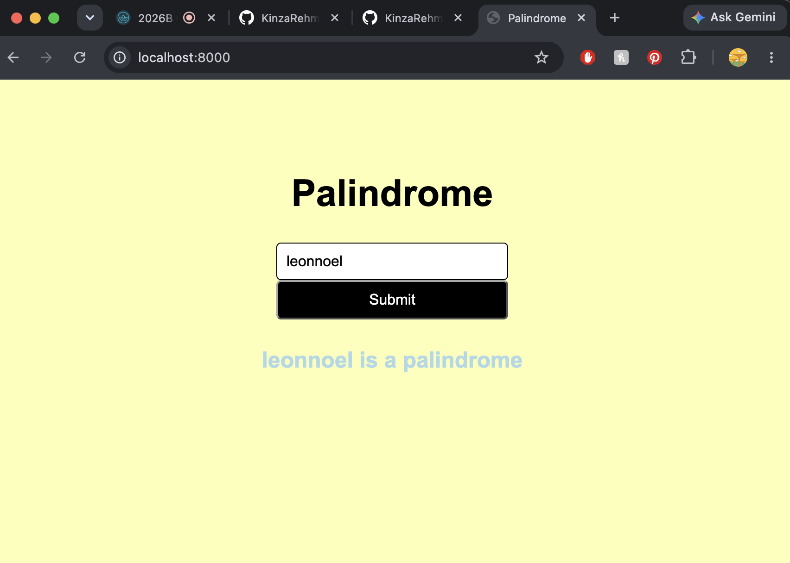

# ↔️ Palindrome Checker

### Goal
Create a simple web application that uses the `fs` and `http` modules to validate if a string is a palindrome server side.


### Photo 


### How It Works
- The user enters a word or phrase.
- The input is sent to the server.
- The server checks if the input is a palindrome.
- The result is sent back and displayed on the page.

### Technologies Used
- HTML
- CSS
- JavaScript
- Node.js
- `http` module
- `fs` module

### Example
`racecar` → Palindrome ✅

`hello` → Not a Palindrome ❌

### Run the Project

```bash
node server.js
```

Then open:

```text
http://localhost:8000
```